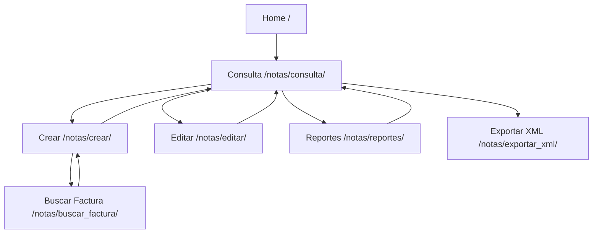

# Documentación API - Módulo Notas Crédito y Débito DIAN

Esta documentación describe los endpoints disponibles en el sistema, incluyendo vistas, URLs, parámetros y respuestas.

## 📋 Información General

### Base URL
- **Desarrollo**: `http://localhost:8000`
- **Producción**: Según configuración del servidor

### Autenticación
- Actualmente no requiere autenticación (para futuras versiones)

### Formato de Datos
- **Request**: Form data (POST), Query parameters (GET)
- **Response**: HTML (vistas web), JSON (AJAX), XML (exportaciones)

### Convenciones
- **Métodos HTTP**: GET, POST
- **Códigos de estado**: Estándar HTTP
- **Encoding**: UTF-8

## 🗂️ Endpoints Principales

### 1. Index / Home
**Endpoint**: `/` o `/notas/`
**Método**: GET
**Vista**: `IndexView`
**Descripción**: Página principal que redirige a consultas

#### Comportamiento
- Redirección automática a `/notas/consulta/`
- No requiere parámetros

#### Respuesta
- **Tipo**: Redirección HTTP (302)
- **Ubicación**: `/notas/consulta/`

---

### 2. Crear Nota
**Endpoint**: `/notas/crear/`
**Método**: GET/POST
**Vista**: `NotaCreateView`
**Descripción**: Formulario para crear nuevas notas

#### Parámetros GET
| Parámetro | Tipo | Requerido | Descripción |
|-----------|------|-----------|-------------|
| `tipo` | string | No | Tipo de nota (credito/debito). Default: credito |

#### Parámetros POST (Formulario)
Ver sección [Campos del Formulario](#campos-del-formulario)

#### Respuesta Exitosa
- **Tipo**: Redirección (302)
- **Ubicación**: `/notas/consulta/`
- **Mensaje**: "Nota generada con éxito"

#### Errores Comunes
- Validación de campos requeridos
- Valores inválidos
- Números duplicados

---

### 3. Editar Nota
**Endpoint**: `/notas/editar/<int:pk>/`
**Método**: GET/POST
**Vista**: `NotaUpdateView`
**Descripción**: Formulario para editar notas existentes

#### Parámetros URL
| Parámetro | Tipo | Descripción |
|-----------|------|-------------|
| `pk` | integer | ID de la nota a editar |

#### Parámetros POST
Ver sección [Campos del Formulario](#campos-del-formulario)

#### Respuesta Exitosa
- **Tipo**: Redirección (302)
- **Ubicación**: `/notas/consulta/`
- **Mensaje**: "Nota actualizada con éxito"

---

### 4. Consultar Notas
**Endpoint**: `/notas/consulta/`
**Método**: GET
**Vista**: `ConsultaNotasView`
**Descripción**: Lista paginada de notas con filtros

#### Parámetros Query
| Parámetro | Tipo | Requerido | Descripción |
|-----------|------|-----------|-------------|
| `tipo` | string | No | Filtrar por tipo (credito/debito) |
| `fecha_desde` | date | No | Fecha inicial (YYYY-MM-DD) |
| `fecha_hasta` | date | No | Fecha final (YYYY-MM-DD) |
| `page` | integer | No | Página de resultados |

#### Respuesta
- **Tipo**: HTML
- **Contenido**: Tabla con notas, formulario de filtros, paginación

#### Datos Mostrados
- Número, Tipo, Fecha Emisión, Factura Referencia
- Código Concepto, Valor Total, Estado
- Acciones: Editar, Exportar XML

---

### 5. Generar Reportes
**Endpoint**: `/notas/reportes/`
**Método**: GET/POST
**Vista**: `ReporteNotasView`
**Descripción**: Generación de reportes Excel

#### Parámetros POST
| Parámetro | Tipo | Requerido | Descripción |
|-----------|------|-----------|-------------|
| `tipo` | string | No | Tipo de nota para filtrar |
| `fecha_desde` | date | No | Fecha inicial |
| `fecha_hasta` | date | No | Fecha final |

#### Respuesta
- **Tipo**: HTML con mensaje
- **Archivo generado**: Excel en `reportes/`
- **Mensaje**: Ubicación del archivo generado

---

### 6. Buscar Factura (AJAX)
**Endpoint**: `/notas/buscar_factura/`
**Método**: GET
**Vista**: `buscar_factura`
**Descripción**: Búsqueda de facturas por número (JSON)

#### Parámetros
| Parámetro | Tipo | Requerido | Descripción |
|-----------|------|-----------|-------------|
| `numero` | string | Sí | Número de factura a buscar |

#### Respuesta Exitosa (JSON)
```json
{
    "success": true,
    "fecha_emision": "2025-01-15",
    "nit_emisor": "901234567",
    "razon_social": "Empresa Ejemplo S.A.S.",
    "total_bruto": "1000000.00",
    "valor_bruto": "836120.00"
}
```

#### Respuesta de Error (JSON)
```json
{
    "success": false,
    "message": "Factura no encontrada"
}
```

---

### 7. Exportar XML
**Endpoint**: `/notas/exportar_xml/<int:pk>/`
**Método**: GET
**Vista**: `exportar_xml`
**Descripción**: Descarga de archivo XML DIAN

#### Parámetros URL
| Parámetro | Tipo | Descripción |
|-----------|------|-------------|
| `pk` | integer | ID de la nota |

#### Respuesta
- **Tipo**: application/xml
- **Header**: Content-Disposition: attachment; filename="nota_{numero}.xml"
- **Contenido**: XML válido según estándar DIAN

## 📝 Campos del Formulario

### Campos Principales
| Campo | Tipo | Requerido | Validaciones |
|-------|------|-----------|--------------|
| `numero` | text | Sí | Único, máx. 50 chars |
| `tipo` | select | Sí | credito/debito |
| `tipo_operacion` | text | Sí | - |
| `fecha_emision` | date | Sí | - |
| `hora_emision` | time | Sí | - |
| `factura_referencia` | text | Sí | - |
| `codigo_concepto` | text | Sí | - |
| `descripcion_concepto` | textarea | Sí | - |
| `valor_base` | decimal | Sí | >= 0 |
| `porcentaje_iva` | decimal | Sí | Default: 0 |
| `valor_iva` | decimal | Sí | Calculado automáticamente |
| `retencion_renta` | decimal | Sí | Calculado automáticamente |
| `porcentaje_retencion` | decimal | Sí | Default: 0 |
| `valor_total` | decimal | Sí | Calculado automáticamente |
| `cufe` | text | No | - |
| `estado` | select | Sí | generado/enviado/aceptado/rechazado |
| `nit_emisor` | text | Sí | - |
| `razon_social_emisor` | text | Sí | - |
| `valor_bruto` | decimal | Sí | Default: 0 |
| `total_bruto` | decimal | Sí | Default: 0 |

### Cálculos Automáticos
```javascript
valor_iva = (valor_base * porcentaje_iva) / 100;
retencion_renta = (valor_bruto * porcentaje_retencion) / 100;
valor_total = valor_bruto + valor_iva - retencion_renta;
```

## 🔄 Flujos de Navegación



## ⚠️ Manejo de Errores

### Códigos de Estado HTTP
- **200**: OK - Solicitud procesada correctamente
- **302**: Found - Redirección (éxito en formularios)
- **400**: Bad Request - Datos inválidos
- **404**: Not Found - Recurso no existe
- **500**: Internal Server Error - Error del servidor

### Mensajes de Error Comunes
- **"Este campo es requerido"**: Campo obligatorio vacío
- **"Asegúrese de que este valor sea mayor o igual a 0"**: Valor negativo
- **"Nota con este Número ya existe"**: Número duplicado
- **"Factura no encontrada"**: Referencia inválida

### Validaciones del Formulario
- **Cliente**: Validaciones básicas (requerido, formato)
- **Servidor**: Validaciones completas con mensajes detallados
- **JavaScript**: Validaciones en tiempo real (futuras implementaciones)

## 🔧 Configuración Técnica

### Settings Relevantes
```python
# Paginación
PAGINATE_BY = 20

# Zona horaria
TIME_ZONE = 'America/Bogota'

# Idioma
LANGUAGE_CODE = 'es-co'

# Archivos estáticos
STATIC_URL = 'static/'
```

### Middlewares Activos
- `SecurityMiddleware`
- `SessionMiddleware`
- `CommonMiddleware`
- `CsrfViewMiddleware`
- `AuthenticationMiddleware`
- `MessageMiddleware`
- `XFrameOptionsMiddleware`

## 📊 Rendimiento

### Optimizaciones Implementadas
- **Paginación**: 20 registros por página
- **Select Related**: Optimización de queries (futuras versiones)
- **Índices**: En campos de búsqueda frecuentes
- **Cache**: No implementado (posible mejora futura)

### Métricas
- **Tiempo de respuesta**: < 500ms para consultas simples
- **Uso de memoria**: ~50MB en reposo
- **Conexiones DB**: Conexión persistente

## 🔒 Seguridad

### Medidas Implementadas
- **CSRF Protection**: Tokens en formularios POST
- **SQL Injection Prevention**: ORM de Django
- **XSS Protection**: Auto-escaping de templates
- **Clickjacking Protection**: X-Frame-Options header

### Recomendaciones Adicionales
- Implementar HTTPS en producción
- Configurar CORS si se exponen APIs
- Agregar rate limiting para endpoints públicos
- Implementar logging de seguridad

## 🧪 Testing

### Endpoints para Testing
```bash
# Crear nota de prueba
curl -X POST http://localhost:8000/notas/crear/ \
  -d "tipo=credito&numero=TEST001&..."

# Buscar factura
curl "http://localhost:8000/notas/buscar_factura/?numero=F001-123"

# Verificar respuesta JSON
curl -H "Accept: application/json" \
     "http://localhost:8000/notas/buscar_factura/?numero=F001-123"
```

### Casos de Prueba
- Creación exitosa de notas
- Validación de campos requeridos
- Búsqueda de facturas existentes/inexistentes
- Exportación XML
- Generación de reportes

## 🚀 Futuras Expansiones

### APIs REST
- Endpoints JSON para integraciones
- Autenticación OAuth/JWT
- Versionado de API (v1, v2)

### WebSockets
- Notificaciones en tiempo real
- Actualización automática de estados

### GraphQL
- Queries flexibles
- Reducción de over-fetching

Esta documentación proporciona una referencia completa para desarrolladores que necesiten integrar o extender el sistema de notas DIAN.