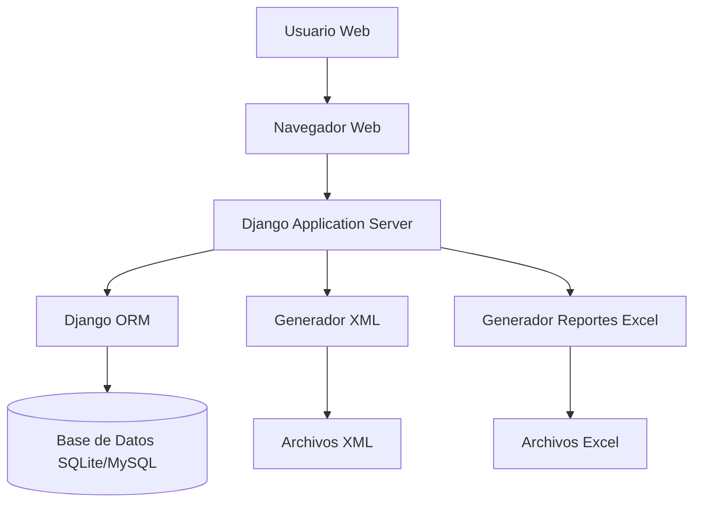
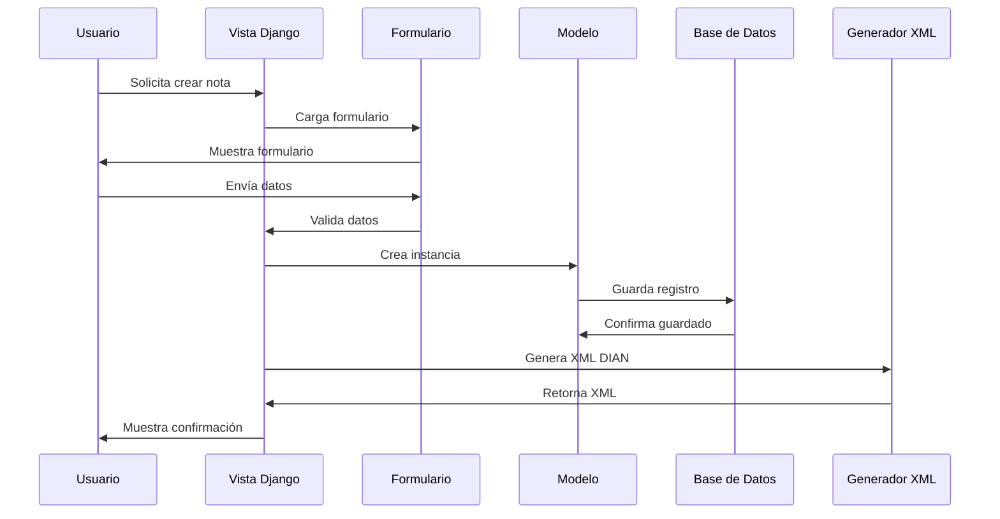

# Arquitectura del Sistema - Módulo Notas Crédito y Débito DIAN

## Visión General

El Módulo Notas Crédito y Débito DIAN es una aplicación web desarrollada en Django que permite generar, gestionar y consultar notas crédito y débito electrónicas conforme a la normativa de la Dirección de Impuestos y Aduanas Nacionales (DIAN) de Colombia.

## Arquitectura General



## Componentes Principales

### 1. Capa de Presentación
- **Framework**: Django Templates con Bootstrap 5
- **Estilos**: CSS personalizado + Font Awesome
- **JavaScript**: Scripts personalizados para interactividad

### 2. Capa de Aplicación
- **Framework**: Django 6.0
- **Módulos principales**:
  - `notas`: App principal con modelos, vistas y formularios
  - `notas_dian`: Configuración del proyecto Django

### 3. Capa de Datos
- **ORM**: Django ORM
- **Base de datos**: SQLite (desarrollo) / MySQL (producción)
- **Modelos principales**:
  - `Factura`: Referencias de facturas
  - `NotaCreditoDebito`: Notas electrónicas

### 4. Servicios Externos
- **DIAN**: Validación y envío de documentos electrónicos
- **Sistema de archivos**: Almacenamiento de XML y reportes

## Estructura de Directorios

```
notas_dian/
├── notas_dian/           # Configuración Django
│   ├── settings.py      # Configuraciones
│   ├── urls.py          # URLs principales
│   └── wsgi.py          # WSGI
├── notas/               # App principal
│   ├── models.py        # Modelos de datos
│   ├── views.py         # Vistas y lógica
│   ├── forms.py         # Formularios
│   ├── urls.py          # URLs de la app
│   ├── utils.py         # Utilidades (XML)
│   └── admin.py         # Admin Django
├── templates/           # Plantillas HTML
│   ├── base.html        # Base común
│   └── notas/           # Templates específicos
├── static/              # Archivos estáticos
│   ├── css/
│   └── js/
├── databases/           # Scripts SQL
├── reportes/            # Reportes generados
└── docs/                # Documentación
```

## Flujo de Datos



## Tecnologías Utilizadas

### Backend
- **Python 3.12+**
- **Django 6.0**: Framework web
- **SQLite/MySQL**: Base de datos
- **Pandas**: Manipulación de datos para reportes
- **OpenPyXL**: Generación de Excel

### Frontend
- **HTML5/CSS3**
- **Bootstrap 5**: Framework CSS
- **JavaScript**: Interactividad
- **Font Awesome**: Iconos

### Desarrollo
- **uv**: Gestor de dependencias
- **Git**: Control de versiones

## Seguridad

- **CSRF Protection**: Protección contra ataques CSRF
- **SQL Injection**: Prevención mediante ORM
- **XSS Protection**: Sanitización de templates
- **Validación**: Validaciones en formularios y modelos

## Escalabilidad

- **Separación de responsabilidades**: Arquitectura MVC
- **Reutilización**: Componentes modulares
- **Extensibilidad**: Fácil adición de nuevas funcionalidades
- **Mantenibilidad**: Código bien estructurado y documentado

## Despliegue

- **Servidor WSGI**: Gunicorn/UWSGI
- **Proxy reverso**: Nginx
- **Base de datos**: MySQL en producción
- **Archivos estáticos**: Servidos por Nginx

## Monitoreo y Logs

- **Django Logging**: Sistema de logs integrado
- **Database Logs**: Triggers para auditoría
- **Error Handling**: Páginas de error personalizadas