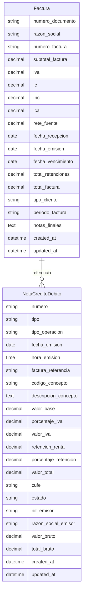

# Modelos de Datos - Módulo Notas Crédito y Débito DIAN

Esta documentación describe los modelos de datos utilizados en el sistema, incluyendo su estructura, campos, relaciones y restricciones.

## 📊 Diagrama Entidad-Relación



## 🗂️ Modelos Principales

### Factura

Modelo que representa las facturas de referencia para las notas crédito y débito.

#### Campos

| Campo | Tipo | Descripción | Requerido | Validaciones |
|-------|------|-------------|-----------|--------------|
| `numero_documento` | CharField(20) | NIT del emisor | Sí | - |
| `razon_social` | CharField(255) | Razón social del emisor | Sí | - |
| `numero_factura` | CharField(50) | Número único de factura | Sí | Único |
| `subtotal_factura` | DecimalField(15,2) | Subtotal de la factura | Sí | >= 0 |
| `iva` | DecimalField(10,2) | Valor del IVA | Sí | Default: 0 |
| `ic` | DecimalField(10,2) | Impuesto al consumo | Sí | Default: 0 |
| `inc` | DecimalField(10,2) | Impuesto nacional al consumo | Sí | Default: 0 |
| `ica` | DecimalField(10,2) | Impuesto de industria y comercio | Sí | Default: 0 |
| `rete_fuente` | DecimalField(10,2) | Retención en la fuente | Sí | Default: 0 |
| `fecha_recepcion` | DateField | Fecha de recepción | Sí | - |
| `fecha_emision` | DateField | Fecha de emisión | Sí | - |
| `fecha_vencimiento` | DateField | Fecha de vencimiento | Sí | - |
| `total_retenciones` | DecimalField(15,2) | Total de retenciones | Sí | Default: 0 |
| `total_factura` | DecimalField(15,2) | Total de la factura | Sí | Default: 0 |
| `tipo_cliente` | CharField(50) | Tipo de cliente | Sí | - |
| `periodo_factura` | CharField(50) | Período de la factura | Sí | - |
| `notas_finales` | TextField | Notas adicionales | No | - |
| `created_at` | DateTimeField | Fecha de creación | Auto | - |
| `updated_at` | DateTimeField | Fecha de actualización | Auto | - |

#### Meta

- **Tabla**: `facturas`
- **Verbose Name**: Factura / Facturas
- **Ordenamiento**: Por defecto (ID)

#### Métodos

- `__str__()`: Retorna "Factura {numero_factura} - {razon_social}"

### NotaCreditoDebito

Modelo principal que representa las notas crédito y débito electrónicas DIAN.

#### Campos

| Campo | Tipo | Descripción | Requerido | Validaciones |
|-------|------|-------------|-----------|--------------|
| `numero` | CharField(50) | Número único de la nota | Sí | Único |
| `tipo` | CharField(10) | Tipo de nota | Sí | Choices: credito/debito |
| `tipo_operacion` | CharField(10) | Tipo de operación DIAN | Sí | - |
| `fecha_emision` | DateField | Fecha de emisión | Sí | - |
| `hora_emision` | TimeField | Hora de emisión | Sí | - |
| `factura_referencia` | CharField(50) | Número de factura referenciada | Sí | - |
| `codigo_concepto` | CharField(10) | Código del concepto DIAN | Sí | - |
| `descripcion_concepto` | TextField | Descripción del concepto | Sí | - |
| `valor_base` | DecimalField(15,2) | Valor base antes de impuestos | Sí | >= 0 |
| `porcentaje_iva` | DecimalField(5,2) | Porcentaje de IVA | Sí | Default: 0 |
| `valor_iva` | DecimalField(15,2) | Valor calculado del IVA | Sí | Default: 0 |
| `retencion_renta` | DecimalField(15,2) | Valor de retención | Sí | Default: 0 |
| `porcentaje_retencion` | DecimalField(5,2) | Porcentaje de retención | Sí | Default: 0 |
| `valor_total` | DecimalField(15,2) | Valor total de la nota | Sí | Default: 0 |
| `cufe` | CharField(255) | Código Único de Facturación | No | - |
| `estado` | CharField(20) | Estado del documento | Sí | Choices: generado/enviado/aceptado/rechazado |
| `nit_emisor` | CharField(20) | NIT del emisor | Sí | - |
| `razon_social_emisor` | CharField(255) | Razón social del emisor | Sí | - |
| `valor_bruto` | DecimalField(15,2) | Valor bruto | Sí | Default: 0 |
| `total_bruto` | DecimalField(15,2) | Total bruto | Sí | Default: 0 |
| `created_at` | DateTimeField | Fecha de creación | Auto | - |
| `updated_at` | DateTimeField | Fecha de actualización | Auto | - |

#### Choices

##### Tipo de Nota
- `credito`: Nota Crédito
- `debito`: Nota Débito

##### Estado
- `generado`: Generado
- `enviado`: Enviado
- `aceptado`: Aceptado
- `rechazado`: Rechazado

#### Meta

- **Tabla**: `notas_credito_debito`
- **Verbose Name**: Nota Crédito/Débito / Notas Crédito/Débito
- **Ordenamiento**: `-fecha_emision`, `-numero`

#### Métodos

- `__str__()`: Retorna "{tipo_display} {numero}"
- `clean()`: Validaciones adicionales (actualmente vacío)

## 🗃️ Estructura de Base de Datos

### Tablas del Sistema

#### notas_credito_debito
Tabla principal con todos los campos descritos arriba.

**Índices**:
- `numero` (único)
- `tipo`
- `fecha_emision`
- `factura_referencia`
- `estado`
- `cufe`
- `created_at`

#### facturas
Tabla de facturas de referencia.

**Índices**:
- `numero_factura` (único)
- `numero_documento`
- `fecha_emision`
- `created_at`

### Estructura MySQL Completa

Para despliegue en producción, se recomienda usar la estructura completa definida en `databases/sql_estructura_bd.sql`, que incluye:

- **notas_credito_debito**: Tabla principal
- **facturas**: Facturas de referencia
- **conceptos_notas**: Conceptos permitidos por DIAN
- **terceros**: Información de emisores/adquirientes
- **numeracion_autorizada**: Numeración DIAN
- **configuracion**: Configuración del sistema
- **log_eventos**: Auditoría de eventos

## 🔗 Relaciones

### Relaciones Explícitas
- **NotaCreditoDebito** referencia **Factura** mediante `factura_referencia` (no es una FK de Django, es un campo de texto)

### Relaciones Implícitas
- Las notas se relacionan con facturas mediante el número de factura de referencia
- Los conceptos están predefinidos según normativa DIAN

## 📝 Validaciones y Reglas de Negocio

### Validaciones Automáticas

1. **Valor Base**: Debe ser >= 0
2. **Porcentajes**: IVA y retención deben ser valores válidos
3. **Números Únicos**: `numero` y `numero_factura` deben ser únicos
4. **Estados**: Solo valores predefinidos

### Cálculos Automáticos

Los siguientes campos se calculan automáticamente en las vistas:

```python
# Cálculo de IVA
valor_iva = (valor_base * porcentaje_iva) / 100

# Cálculo de retención
retencion_renta = (valor_bruto * porcentaje_retencion) / 100

# Cálculo del total
valor_total = valor_bruto + valor_iva - retencion_renta
```

### Reglas DIAN

1. **Tipos de Operación**: Según Anexo Técnico 1.9
   - 20: Nota Crédito que referencia una factura
   - 22: Nota Crédito sin referencia a factura
   - 30: Nota Débito que referencia una factura
   - 32: Nota Débito sin referencia a factura

2. **Conceptos por Tipo**:
   - **Nota Crédito**: Devolución, anulación, rebaja, descuento, rescisión, otros
   - **Nota Débito**: Intereses, gastos por cobrar, cambio de valor, otros

## 🔄 Migraciones

### Migraciones Django

Las migraciones están en `notas/migrations/`:

- `0001_initial.py`: Creación inicial de modelos

### Actualización de Modelos

Para modificar modelos:

```bash
# Crear migración
python manage.py makemigrations

# Aplicar migración
python manage.py migrate
```

## 📊 Consultas Comunes

### Notas por Tipo y Fecha

```python
from notas.models import NotaCreditoDebito
from datetime import date

# Notas de crédito del mes actual
notas_credito = NotaCreditoDebito.objects.filter(
    tipo='credito',
    fecha_emision__year=date.today().year,
    fecha_emision__month=date.today().month
)
```

### Búsqueda por Factura

```python
# Notas que referencian una factura específica
notas = NotaCreditoDebito.objects.filter(
    factura_referencia='F001-123'
)
```

### Reportes por Estado

```python
from django.db.models import Count

# Conteo por estado
estados = NotaCreditoDebito.objects.values('estado').annotate(
    total=Count('id')
)
```

## 🔒 Consideraciones de Seguridad

### Validación de Datos
- Todos los campos monetarios tienen validadores de rango
- Los campos de texto tienen límites de longitud
- Las fechas se validan automáticamente

### Auditoría
- Campos `created_at` y `updated_at` para tracking
- Logs de eventos en producción (estructura MySQL completa)

### Integridad Referencial
- Claves únicas evitan duplicados
- Validaciones en formularios previenen datos inválidos

## 🚀 Extensibilidad

### Agregar Nuevos Campos

1. Modificar modelo en `models.py`
2. Crear migración: `python manage.py makemigrations`
3. Aplicar migración: `python manage.py migrate`
4. Actualizar formularios en `forms.py`
5. Modificar templates si es necesario

### Nuevos Modelos

Para agregar nuevos modelos relacionados:

1. Definir modelo en `models.py`
2. Agregar relaciones si aplica
3. Crear migraciones
4. Registrar en `admin.py` si es necesario
5. Crear vistas y URLs correspondientes

Esta estructura de datos proporciona una base sólida para el manejo de notas electrónicas DIAN, cumpliendo con los requisitos normativos y permitiendo futuras expansiones del sistema.