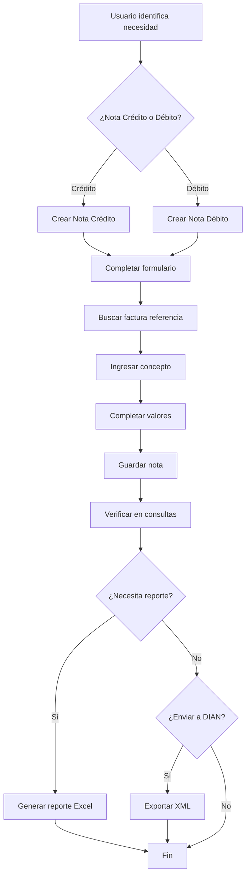

# Guía del Usuario - Módulo Notas Crédito y Débito DIAN

Esta guía proporciona instrucciones completas para usar el Módulo Notas Crédito y Débito DIAN, desde la creación de notas hasta la generación de reportes.

## 🚀 Inicio Rápido

### Acceso a la Aplicación

1. Abrir navegador web
2. Ir a `http://localhost:8000` (desarrollo) o la URL de producción
3. La aplicación carga directamente en la página principal

### Interfaz Principal

La interfaz cuenta con:
- **Barra de navegación**: Acceso a todas las funciones
- **Mensajes**: Notificaciones de acciones realizadas
- **Contenido principal**: Formularios y listados

## 📝 Crear Notas

### Tipos de Notas

El sistema permite crear dos tipos de notas electrónicas:

#### Nota Crédito
- **Propósito**: Disminuir el valor de una factura existente
- **Casos de uso**: Devoluciones, descuentos, correcciones

#### Nota Débito
- **Propósito**: Aumentar el valor de una factura existente
- **Casos de uso**: Intereses, gastos adicionales, correcciones

### Proceso de Creación

#### Paso 1: Seleccionar Tipo de Nota

1. En la barra de navegación, hacer clic en:
   - **"Nueva Nota Crédito"** para crear una nota crédito
   - **"Nueva Nota Débito"** para crear una nota débito

2. Se abre el formulario de creación

#### Paso 2: Completar Información Básica

| Campo | Descripción | Ejemplo |
|-------|-------------|---------|
| **Número** | Identificador único de la nota | NC001-001 |
| **Tipo Operación** | Código DIAN (20, 22, 30, 32) | 20 |
| **Fecha Emisión** | Fecha de emisión de la nota | 2025-01-15 |
| **Hora Emisión** | Hora de emisión | 14:30:00 |

#### Paso 3: Referenciar Factura

**Opción A: Búsqueda Automática**
1. Ingresar el número de factura en "Factura Referencia"
2. Hacer clic en el botón de búsqueda (lupa)
3. El sistema buscará y autocompletará:
   - Fecha de emisión de la factura
   - NIT del emisor
   - Razón social
   - Valor bruto
   - Valor total

**Opción B: Ingreso Manual**
1. Completar manualmente todos los campos de referencia

#### Paso 4: Definir Concepto

Seleccionar el concepto según normativa DIAN:

**Para Nota Crédito:**
- 1: Devolución parcial de los bienes
- 2: Anulación de la operación
- 3: Rebaja total aplicada
- 4: Descuento total aplicado
- 5: Rescisión de la operación
- 6: Otros

**Para Nota Débito:**
- 1: Intereses
- 2: Gastos por cobrar
- 3: Cambio del valor
- 4: Otros

#### Paso 5: Ingresar Valores

| Campo | Descripción | Cálculo |
|-------|-------------|---------|
| **Valor Bruto** | Valor base sin impuestos | Se obtiene de la factura |
| **Valor Base** | Base para cálculo de IVA | Generalmente igual al valor bruto |
| **% IVA** | Porcentaje de IVA aplicable | 19% (Colombia) |
| **Valor IVA** | IVA calculado | (Valor Base × % IVA) ÷ 100 |
| **% Retención** | Porcentaje de retención | Según normativa |
| **Retención Renta** | Retención calculada | (Valor Bruto × % Retención) ÷ 100 |
| **Valor Total** | Total de la nota | Valor Bruto + IVA - Retención |

**Nota**: Los campos marcados con * son calculados automáticamente.

#### Paso 6: Información del Emisor

| Campo | Descripción |
|-------|-------------|
| **NIT Emisor** | Número de identificación tributaria |
| **Razón Social Emisor** | Nombre legal de la empresa |

#### Paso 7: Guardar Nota

1. Revisar todos los datos
2. Hacer clic en **"Guardar"**
3. El sistema:
   - Valida los datos
   - Calcula valores automáticos
   - Guarda la nota
   - Muestra mensaje de confirmación
   - Redirige a la lista de consultas

## 🔍 Consultar Notas

### Acceso a Consultas

1. Hacer clic en **"Consultas"** en la barra de navegación
2. Se muestra la lista de notas con filtros

### Filtros Disponibles

| Filtro | Descripción | Opciones |
|--------|-------------|----------|
| **Tipo** | Filtrar por tipo de nota | Todas, Crédito, Débito |
| **Fecha Desde** | Fecha inicial del rango | Formato: YYYY-MM-DD |
| **Fecha Hasta** | Fecha final del rango | Formato: YYYY-MM-DD |

### Funciones de la Lista

#### Visualización
- **Paginación**: 20 notas por página
- **Ordenamiento**: Por fecha de emisión (más reciente primero)
- **Columnas**: Número, Tipo, Fecha, Factura Ref., Concepto, Valor Total, Estado

#### Acciones por Nota
- **Editar**: Modificar datos de la nota
- **Exportar XML**: Descargar archivo XML DIAN
- **Ver detalles**: Información completa

### Búsqueda Avanzada

- Usar combinación de filtros para consultas específicas
- Ejemplo: Notas de crédito del último mes

## ✏️ Editar Notas

### Proceso de Edición

1. En la lista de consultas, identificar la nota a editar
2. Hacer clic en el botón **"Editar"** (icono lápiz)
3. Se abre el formulario con datos actuales
4. Modificar los campos necesarios
5. Los cálculos se actualizan automáticamente
6. Guardar cambios

### Restricciones
- No se puede cambiar el número de nota (identificador único)
- Validaciones se aplican igual que en creación

## 📊 Generar Reportes

### Acceso a Reportes

1. Hacer clic en **"Reportes"** en la barra de navegación
2. Seleccionar rango de fechas
3. Hacer clic en **"Generar Reporte"**

### Características del Reporte

#### Formato
- **Archivo**: Excel (.xlsx)
- **Ubicación**: Carpeta `reportes/`
- **Nombre**: `reporte_notas_FECHA_DESDE_a_FECHA_HASTA.xlsx`

#### Columnas Incluidas
- Número
- Tipo
- Tipo Operación
- Fecha Emisión
- Factura Referencia
- Código Concepto
- Descripción Concepto
- Valor Base
- % IVA
- Valor IVA
- % Retención
- Retención Renta
- Valor Total
- Estado
- NIT Emisor
- Razón Social Emisor
- Total Bruto

### Filtros de Reporte
- **Tipo**: Todas las notas, solo crédito, solo débito
- **Rango de fechas**: Período específico

### Descarga
- El archivo se genera automáticamente
- Mensaje de confirmación con ubicación del archivo
- Archivo disponible para descarga inmediata

## 📤 Exportar XML

### Proceso de Exportación

1. En la lista de consultas, localizar la nota
2. Hacer clic en **"Exportar XML"** (icono descarga)
3. El navegador descarga automáticamente el archivo

### Características del XML

#### Nombre del Archivo
- Formato: `nota_{numero}.xml`
- Ejemplo: `nota_NC001-001.xml`

#### Contenido
- XML válido según estándar DIAN
- Incluye todos los datos de la nota
- Formato para envío a DIAN

#### Validación
- Estructura conforme Anexo Técnico 1.9
- Codificación UTF-8
- Datos completos y precisos

## 🔄 Flujo de Trabajo Típico

## ⚠️ Manejo de Errores

### Errores Comunes

#### "Factura no encontrada"
- **Causa**: Número de factura incorrecto
- **Solución**: Verificar ortografía y formato

#### "Valor inválido"
- **Causa**: Valores negativos o fuera de rango
- **Solución**: Ingresar valores positivos válidos

#### "Campo requerido"
- **Causa**: Campos obligatorios sin completar
- **Solución**: Completar todos los campos marcados con *

#### "Número duplicado"
- **Causa**: Número de nota ya existe
- **Solución**: Usar número único

### Recuperación de Errores

1. **Mensajes de error**: Aparecen en la parte superior de la página
2. **Datos preservados**: El formulario mantiene los datos ingresados
3. **Reintento**: Corregir errores y guardar nuevamente

## 📱 Interfaz Responsiva

### Dispositivos Soportados
- **Desktop**: Pantallas grandes (1920x1080+)
- **Laptop**: Pantallas medianas (1366x768+)
- **Tablet**: Pantallas pequeñas (768x1024+)
- **Mobile**: Pantallas muy pequeñas (375x667+)

### Adaptaciones
- **Menú**: Se colapsa en móviles
- **Tablas**: Scroll horizontal en pantallas pequeñas
- **Formularios**: Campos se reorganizan automáticamente
- **Botones**: Tamaño adecuado para touch

## 🔐 Seguridad

### Recomendaciones de Uso
- **URLs seguras**: Usar HTTPS en producción
- **Actualizaciones**: Mantener la aplicación actualizada
- **Backups**: Realizar copias de seguridad regulares
- **Acceso**: Controlar quién tiene acceso al sistema

### Validaciones Implementadas
- **CSRF Protection**: Protección contra ataques cross-site
- **SQL Injection**: Prevención mediante ORM
- **XSS**: Sanitización de datos
- **Validación**: Datos validados en cliente y servidor

## 📞 Soporte y Ayuda

### Recursos Disponibles
- **Documentación**: Esta guía completa
- **Mensajes**: Tooltips y ayuda contextual
- **Validaciones**: Mensajes de error descriptivos

### Contacto
- **Issues**: Reportar bugs en GitHub
- **Soporte**: Contactar al administrador del sistema
- **Actualizaciones**: Revisar changelog

## 🎯 Consejos y Mejores Prácticas

### Eficiencia
- **Búsqueda de facturas**: Usar la función de búsqueda automática
- **Filtros**: Aplicar filtros para encontrar notas rápidamente
- **Paginación**: Navegar eficientemente en listados largos

### Precisión
- **Verificación**: Revisar datos antes de guardar
- **Cálculos**: Confiar en cálculos automáticos
- **Formatos**: Usar formatos correctos (fechas, números)

### Organización
- **Números**: Usar sistema de numeración consistente
- **Fechas**: Mantener consistencia en fechas
- **Conceptos**: Seleccionar conceptos apropiados

### Mantenimiento
- **Limpieza**: Eliminar notas de prueba regularmente
- **Backups**: Mantener copias de seguridad
- **Actualizaciones**: Aplicar actualizaciones cuando estén disponibles

Siguiendo esta guía, podrás utilizar eficientemente el Módulo Notas Crédito y Débito DIAN para gestionar tus documentos electrónicos de manera efectiva y conforme a la normativa colombiana.